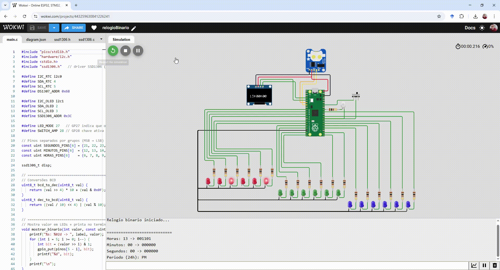

# ⏰ Relógio Binário com Raspberry Pi Pico / Pico W

Um projeto **DIY** para criar um relógio binário usando **Raspberry Pi Pico**, **RTC DS1307** e um **OLED SSD1306**.  
Com direito a LEDs piscando, hora certinha, display OLED e **sincronização WiFi automática** (Pico W). 😍

---

## ✨ Features

### 🔴 Funcionalidades Básicas
- 🟢 Mostra **horas, minutos e segundos** em **binário** com LEDs  
- 🔄 Alterna entre **formato 24h** e **12h (AM/PM)** com uma chave no **GP28**  
- 💡 LED no **GP27** indica quando o modo **12h** está ativo  
- ⏱️ Relógio de tempo real (RTC) **DS1307** para manter a hora mesmo sem energia  
- 🖥️ Tela **OLED SSD1306** exibe a hora em texto (grande e bonito 😎)  

### 🔵 Funcionalidades Novas (2025) - WiFi + NTP
- 📡 **Comando SET via Serial**: `SET HH:MM:SS` para atualizar hora sem recompilar
- 🌐 **WiFi + NTP** (Pico W apenas): Sincronização automática com servidor NTP
- ⏰ **Sincronização a cada 30 minutos** (configurável via `SYNCINTERVAL`)
- 🎮 **Controle via Terminal Serial**: 4 comandos novos para total controle

---

## 🛠️ Hardware

### Requerido (todos os modelos)
- **Raspberry Pi Pico** OU **Pico W** (recomendado para WiFi)
- Módulo RTC **DS1307** + bateria CR2032  
- Display OLED **SSD1306 (128x64, I²C)**  
- LEDs + resistores para horas/minutos/segundos  
- 1 chave/toggle switch (GP28 → GND)  

### Opcional (apenas Pico W)
- WiFi 2.4GHz com segurança WPA2

---

## ⚡ Ligações

### 🕒 RTC DS1307 (I²C0 - GP4/GP5)
- SDA → GP4  
- SCL → GP5  
- VCC → 3V3  
- GND → GND  

### 🖥️ OLED SSD1306 (I²C1 - GP2/GP3)
- SDA → GP2  
- SCL → GP3  
- VCC → 3V3  
- GND → GND  

### 💡 LEDs Binários
- **Segundos** → GP21..GP26  
- **Minutos** → GP12..GP17  
- **Horas** → GP6..GP11  

### 🔘 Controle
- GP27 → LED indicador de modo 12h  
- GP28 → Chave seletora (0 = AM/PM, 1 = 24h)  

---

## 🖼️ Montagem & 🎮 Demonstração

  

> ✨ O GIF acima mostra a protoboard montada com o Raspberry Pi Pico, o módulo RTC DS1307, o OLED SSD1306 e os LEDs funcionando em tempo real.

---

## 📡 Novos Comandos Serial (Terminal - 115200 baud)

### Atualizar Hora Manualmente
```
SET 14:30:45
```
✅ Hora atualiza sem recompilar!

### Conectar WiFi (Pico W)
```
WIFI seu_ssid sua_senha
```
✅ Conecta ao WiFi WPA2

### Sincronizar com NTP (Pico W)
```
SYNC
```
✅ Sincroniza com pool.ntp.org

### Configurar Intervalo de Sincronização (Pico W)
```
SYNCINTERVAL 30
```
✅ Define intervalo em minutos (1-1440)

---

## 🧑‍💻 Simulação no Wokwi

Este projeto também pode ser testado **online no Wokwi** 🎉  

👉 [Abrir simulação no Wokwi](https://wokwi.com/projects/443259630841226241)

Além disso, todos os arquivos da simulação estão disponíveis neste repositório:  

```
wokwi_simulation/relogioBinario/
```

Basta abrir a pasta no [Wokwi](https://wokwi.com/) e rodar a simulação direto no navegador 🚀

---

## 🚀 Como Compilar e Gravar

### Requisitos
- Git
- CMake 3.12+
- ARM GCC (arm-none-eabi-gcc)
- Pico SDK 2.0+

### Passo 1: Clonar Repositório
```bash
git clone https://github.com/Marco-Mello/relogioBinario.git
cd relogioBinario
```

### Passo 2: Configurar SDK (primeira vez apenas)
```bash
git clone https://github.com/raspberrypi/pico-sdk.git ~/pico-sdk
git clone https://github.com/raspberrypi/pico-extras.git ~/pico-extras

# Windows: Configure variáveis
setx PICO_SDK_PATH \"C:\\Users\\SeuUsuario\\pico-sdk\"
setx PICO_EXTRAS_PATH \"C:\\Users\\SeuUsuario\\pico-extras\"

# Linux/Mac: Adicione ao ~/.bashrc ou ~/.zshrc
export PICO_SDK_PATH=~/pico-sdk
export PICO_EXTRAS_PATH=~/pico-extras
```

### Passo 3: Compilar
```bash
cd vscode_pico-sdk
mkdir build
cd build
cmake ..
make -j4
```

### Passo 4: Gravar no Pico
1. Pressione **BOOTSEL** no Pico/Pico W
2. Conecte USB
3. Copie `pico_emb.uf2` para drive **RPI-RP2**

### Passo 5: Testar (Terminal Serial - 115200)
```
> SET 14:30:45
✓ Hora atualizada para 14:30:45

# Se for Pico W:
> WIFI seu_wifi sua_senha
✓ WiFi conectado!

> SYNC
✓ NTP sincronizado com sucesso!
```

---

## 📚 Documentação Completa

| Documento | Descrição |
|-----------|-----------|
| [UPDATES_README.md](UPDATES_README.md) | O que mudou em 2025 |
| [EXECUTIVE_SUMMARY.md](EXECUTIVE_SUMMARY.md) | Resumo executivo |
| [SERIAL_COMMANDS.md](SERIAL_COMMANDS.md) | Guia do comando SET |
| [WIFI_NTP.md](WIFI_NTP.md) | Guia WiFi + NTP (Pico W) |
| [COMPILATION.md](COMPILATION.md) | Detalhes de compilação |
| [QUICK_REFERENCE.md](QUICK_REFERENCE.md) | Referência rápida |
| [DOCUMENTATION_INDEX.md](DOCUMENTATION_INDEX.md) | Índice completo |
| [FIX_SDK_ERROR.md](FIX_SDK_ERROR.md) | Troubleshooting |

---

## 🎯 Compatibilidade

| Feature | Pico | Pico W |
|---------|------|--------|
| Display/LEDs | ✅ | ✅ |
| RTC DS1307 | ✅ | ✅ |
| Comando SET | ✅ | ✅ |
| WiFi | ❌ | ✅ |
| NTP Auto | ❌ | ✅ |

---

## 🐛 Troubleshooting

### \"Failed to download and install SDK\"
→ Consulte [FIX_SDK_ERROR.md](FIX_SDK_ERROR.md)

### CMake não encontrado
→ Instale CMake: https://cmake.org/download/

### WiFi não conecta
→ Leia seção \"Erros Comuns\" em [WIFI_NTP.md](WIFI_NTP.md)

---

## 📝 Estrutura do Projeto

```
relogioBinario/
├── README.md (este arquivo)
├── vscode_pico-sdk/          # Código compilável
│   └── main/
│       ├── main.c             # Lógica principal
│       ├── wifi_ntp.c         # WiFi + NTP (novo)
│       ├── ssd1306.c/h        # Driver OLED
│       └── CMakeLists.txt
├── wokwi_simulation/          # Simulação Wokwi
└── Documentação/
    ├── UPDATES_README.md
    ├── SERIAL_COMMANDS.md
    ├── WIFI_NTP.md
    ├── COMPILATION.md
    └── ... (mais documentos)
```

---

## 💡 Exemplos de Uso

### Cenário 1: Relógio Manual (qualquer Pico)
```
SET 08:30:00   # Atualiza para 8:30 AM
SET 20:45:30   # Atualiza para 8:45:30 PM
```

### Cenário 2: Relógio Automático (Pico W)
```
WIFI MeuWiFi Senha123    # Conecta ao WiFi
SYNC                     # Sincroniza agora
SYNCINTERVAL 30          # Sincroniza cada 30 min
# Pronto! Hora sempre precisa, sem intervenção
```

---

## 🔒 Segurança WiFi

- Recomendado: WPA2 / WPA2-PSK
- Não suportado: WEP, WiFi aberta
- WiFi: 2.4GHz (não suporta 5GHz)
- Senha: Sem caracteres especiais (use alfanuméricos)

---

## 📊 Especificações

| Aspecto | Valor |
|---------|-------|
| Servidor NTP | pool.ntp.org |
| Intervalo padrão | 30 minutos |
| Precisão | ±1-2 segundos |
| Timeout NTP | 5 segundos |
| Baud rate serial | 115200 |
| Tamanho binário | ~170 KB |
| Compatibilidade | Pico W (WiFi) |

---

## 📜 Licença

MIT License © 2025 — feito com 💜 e café ☕

---

## 🙏 Contribuições

Encontrou um bug? Tem uma sugestão? Abra uma issue ou PR!

---

**Desenvolvido para Raspberry Pi Pico e Pico W**  
*Última atualização: Setembro 2025*
"